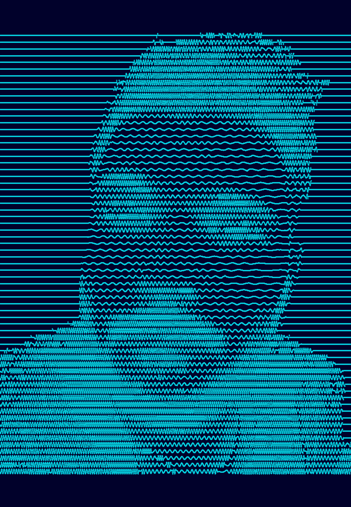
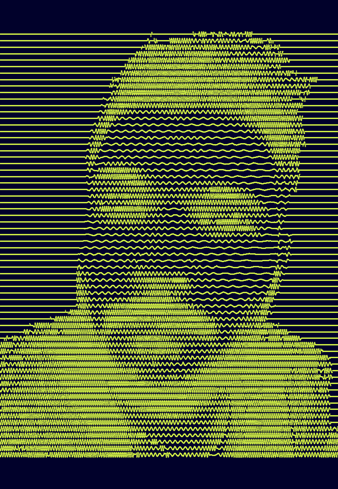

# Unknow pleasure processing

This sketch is my custom version of this sketch from this [Reddit] discussion started by u/d_ynamic. (He share his original versione in this [gist])

&nbsp; &nbsp; &nbsp; &nbsp; &nbsp; &nbsp; &nbsp; &nbsp;  


It also generate the frames for creating a gif.


  


And it is possible to change the colors:

&nbsp; &nbsp; &nbsp; &nbsp; &nbsp; &nbsp; &nbsp; &nbsp;  &nbsp; &nbsp; &nbsp; &nbsp; &nbsp; &nbsp; &nbsp; &nbsp;  


To use it, start with a grayscale image, remove the unecessary background (it only creates noise in the image) and than save this image as image.png. Than put this image in the sketch folder, run the sketch and it create the output image and a folder with all the frames for build the gif. To make my own gif i used (https://ezgif.com/) that as the name says is easy to use it!


To customize the output, just change this values as you want.
```java
color backgr = 255;
color linesColor = 0;
float step = 66.0f;
float wavePeriod = 4f;
```
[Reddit]: https://www.reddit.com/r/generative/comments/g7o79g/processing_3_50_lines/
[gist]: https://gist.github.com/u-ndefine/8e4bc21be4275f87fefe7b2a68487161