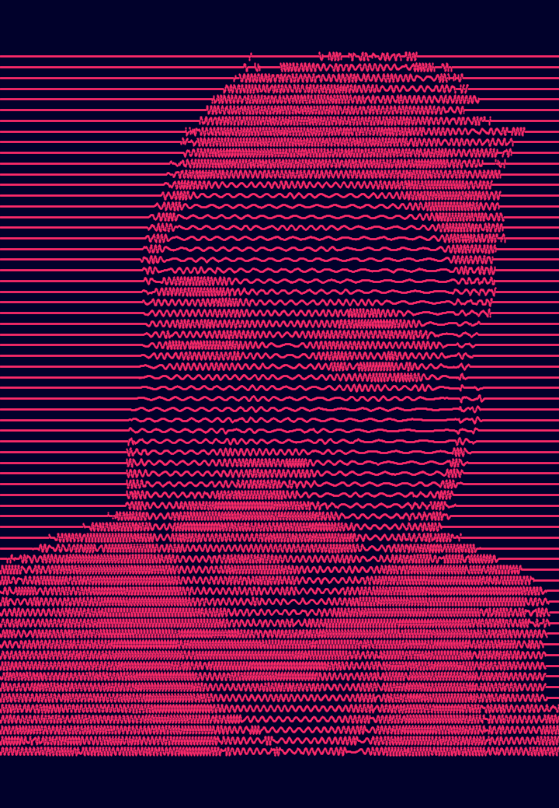

# Unknow pleasure processing

This sketch is my custom version of this sketch from this [Reddit] discussion started by u/d_ynamic. (He share his original versione in this [gist])

  

It also generate the frames for creating a gif.

  

And it is possible to change the colors:

   

[Reddit]: https://www.reddit.com/r/generative/comments/g7o79g/processing_3_50_lines/
[gist]: https://gist.github.com/u-ndefine/8e4bc21be4275f87fefe7b2a68487161